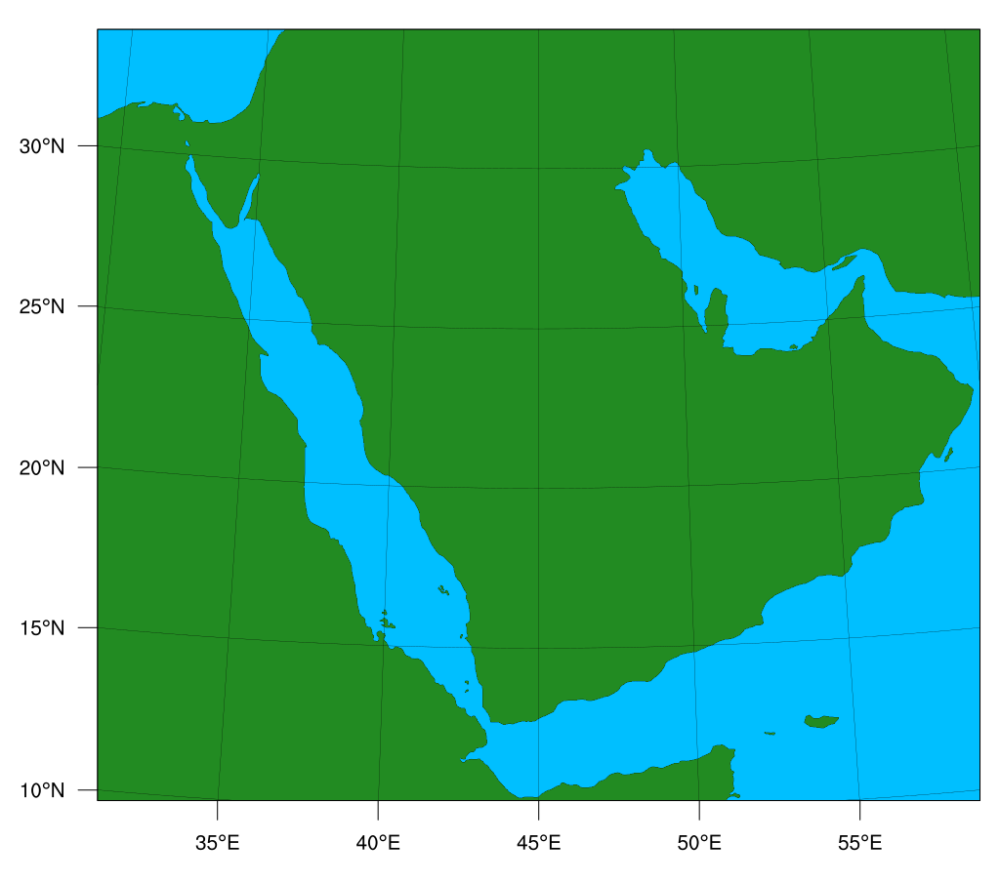
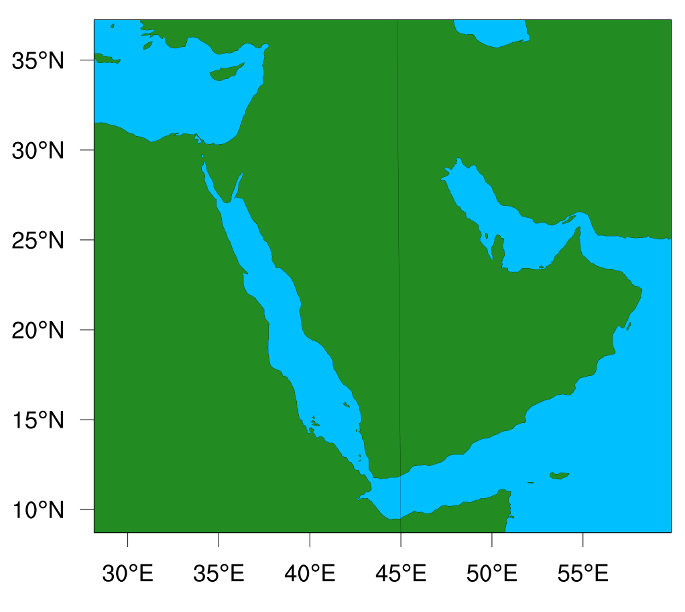

# Development of the AP regional coupled model for S2S prediction

- [ ] Domain, Grid and Resolution
- [ ] Setting up standalone WRF and MITgcm for new domain. Make hindcasts and evaluate against the S2S models (Feb-March 2023)
- [ ] Setting up the coupled model and make test simulations (March-April 2023)
- [ ] Developing an end-to-end automated workflow using [CYLC](https://cylc.github.io) workflow engine (April-May 2023)
- [ ] Run hindcasts and evaluate against the standalone S2S models (June-August 2023)
- [ ] Optimize the coupled model for performance (September 2023)
- [ ] [Develop an automated evaluation framework] (October 2023)

## Domain, Grid and Resolution
The coupled model domain will be kept as similar/close as possible to the current standalone S2S model.

|  |  |
|:--:|:--:|
| Figure 1: The coupled S2S domain | Figure 2: The current standalone S2S domain |
| Projection: Lat-Lon | Projection: Lambert | 
| Resolution:   0.036 degrees(<4km; ATM),   0.018 degrees (<2km; OCN) | Resolution: 4km | 
| No: of grid points in ATM:   840 x 750 (630000) | No: of grid points in ATM:   768 x 672 (516096) |
| 22% more grid points |  |
| ref_lat   =  23.65, ref_lon   =  46.0 | ref_lat   =  22.3, ref_lon   =  45.0 |

 

<!-- |  |
|:--:|
| Figure 2: The coupled S2S domain 1 |
| Projection: Lat-Lon (Cyllindrical Equidistant), Resolution: 0.036 degrees |
| No: of grid points: 900 x 800 (720000, 40% more grid points) |
| ref_lat   =  24, ref_lon   =  44.0 |

  -->

<!-- The initial plan is to use identical horizontal grids for both atmosphere and ocean to eliminate the complication of regridding winds near steep orography and complex coastlines (Sun et al. 2019, 2021).  -->

##